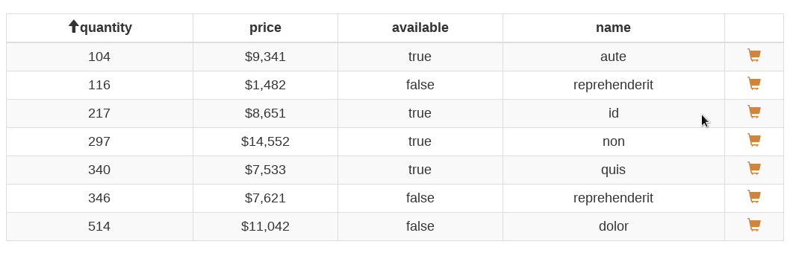
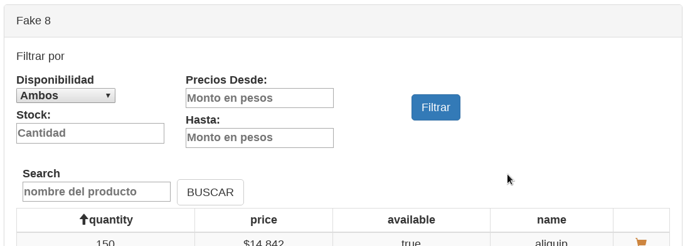
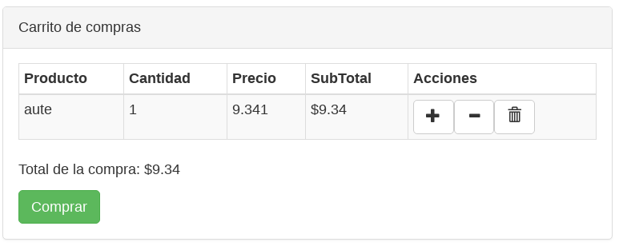

# E-commerce - challenge

This is an e-commerce SPA made with `React` as the main technology.

## Running Locally

1. git clone this repo and go the the cloned repo
1. `npm install`
1. `npm run dev`

## Some libraries and techs used

2. parcel - used to bundle the project, easy to set up.
3. react-bootstrap - This helps me with the responsive design and other styles.
4. react-emotion - Used to do css in js and minor styles inside components.

## UX

It's done with the intention to make the user experience very dynamic.

### Product Table

Features:

3. Headers are clickable and this event fire an `ASC` or `DESC` sort on the column.
4. Carts on the right works to add a new product to the shopping cart.
5. Is related to the filter form above. This allow the user get products filtering by any of those values.
6. _search_ widget will be hidden until the user navigate to a final sublevel. A final sublevel is a menu option that doesn't have any sublevels

### Shopping cart

Features:

4. Is hidden until the user adds a new product from `Products Table`
5. Remove product if it's quantity is equal to 0.
6. After click on `Comprar` it's going to be hidden again.

 
